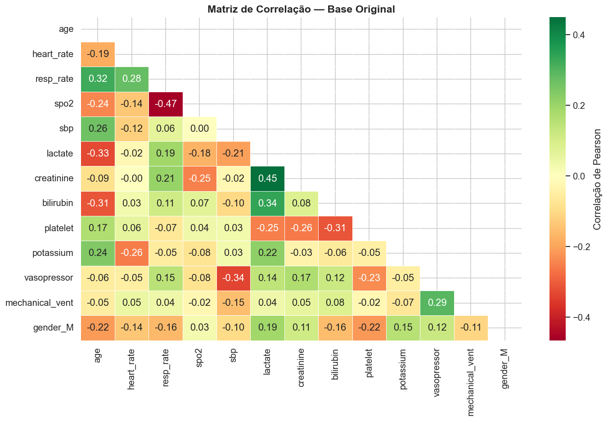

# Inteligência Artificial Generativa na Medicina Diagnóstica para Identificação de Subfenótipos de Sepse

**Trabalho de Conclusão de Curso — MBA Data Science e Analytics | USP/ESALQ**

| | |
|---|---|
| **Aluno** | João Gabriel Pereira Ferreira |
| **Orientador** | Prof. Dr. Renato Máximo Sátiro |
| **Base de dados** | [MIMIC-III Clinical Database Demo](https://physionet.org/content/mimiciii-demo/1.4/) (PhysioNet) |
| **Notebook principal** | [`TCC_Sepse_MIMIC_CTGAN_GMM.ipynb`](TCC_Sepse_MIMIC_CTGAN_GMM.ipynb) |

---

## 1. Objetivo

Este trabalho investiga o uso de **inteligência artificial generativa** (CTGAN) combinada a **técnicas de clusterização não supervisionada** para identificar **subfenótipos clínicos de sepse** — perfis de pacientes com padrões distintos de disfunção orgânica e gravidade, na linha do estudo de referência **Seymour et al. (2019, JAMA)**, que descreve quatro fenótipos (α, β, γ, δ).

A motivação central é dupla:

1. **Expandir uma base clínica pequena** (100 pacientes do MIMIC-III Demo) de forma sintética e estatisticamente fiel, usando um *Conditional Tabular GAN*, para viabilizar análises de agrupamento mais robustas.
2. **Comparar múltiplos algoritmos e estratégias de clusterização** de forma criteriosa (métricas internas, estabilidade via bootstrap e alinhamento com a literatura clínica), em vez de escolher um único método por conveniência.

## 2. Estrutura do pipeline

O notebook está organizado em seções sequenciais e executáveis de ponta a ponta:

| Seção | Descrição | Principais bibliotecas |
|---|---|---|
| 0 | Configuração e imports | `pandas`, `numpy`, `scikit-learn` |
| 1 | Extração e estruturação dos dados MIMIC-III Demo (`PATIENTS`, `ADMISSIONS`, `ICUSTAYS`, `CHARTEVENTS`, `LABEVENTS`, `DIAGNOSES_ICD`, `PRESCRIPTIONS`) | `pandas` |
| 2 | Pré-processamento (imputação por mediana, padronização, pipeline reprodutível) | `scikit-learn` |
| 3 | Expansão sintética com **CTGAN** (2×, 5× e 10× o tamanho original) | `sdv` |
| 4 | Avaliação da qualidade sintética (Column Shapes, Column Pair Trends) | `sdmetrics` |
| 4.5 | Engenharia de variáveis derivadas com limiares clínicos (SOFA/Sepsis-3) | `pandas` |
| 5 | Pipeline avançado de clusterização clínica: `RobustScaler` + winsorização, `severity_score` composto, 3 conjuntos de *features* (originais, derivadas, híbrido) | `scikit-learn` |
| 6 | Comparação multi-algoritmo: **KMeans, GMM, Agglomerative, DBSCAN/HDBSCAN** | `scikit-learn`, `hdbscan` |
| 7 | *Bootstrap* de estabilidade + `composite_score` + seleção do melhor modelo | `scikit-learn` |
| 8 | Análise estatística dos clusters (Kruskal-Wallis, qui-quadrado) | `scipy` |
| 9 | Nomenclatura clínica e alinhamento com Seymour et al. (2019) | `pandas` |
| 10 | Visualizações comparativas (PCA, UMAP, heatmaps) | `matplotlib`, `seaborn`, `umap-learn` |
| 11 | Relatório final de clusterização clínica | — |

> Quando os CSVs do MIMIC-III Demo não estão disponíveis localmente, a Seção 1.2 gera dados clínicos simulados com distribuições compatíveis com a literatura, permitindo a execução completa do pipeline mesmo sem a base original.

## 3. Principais resultados

### 3.1 Expansão sintética (CTGAN)

A qualidade dos dados sintéticos foi avaliada com o **Quality Report** do `sdmetrics` (similaridade de distribuições univariadas e preservação de correlações bivariadas), atingindo um *score* de qualidade geral de referência ~0,76 no cenário final de configuração do pipeline.




### 3.2 Clusterização clínica

Foram comparadas sistematicamente combinações de **3 conjuntos de features × 4 algoritmos × k de 2 a 8**, avaliadas por Silhouette, Davies-Bouldin, Calinski-Harabasz, balanceamento dos clusters e estabilidade via *bootstrap*, consolidadas em um `composite_score` (ver [`outputs_cluster_clinico/results_clustering_comparison.csv`](outputs_cluster_clinico/results_clustering_comparison.csv)).

- O **k estatisticamente ótimo** (maior Silhouette isolado) foi **k=3** (Silhouette ≈ 0,77).
- O **modelo final escolhido** foi **KMeans com k=4** sobre o conjunto de variáveis originais (Silhouette ≈ 0,71; validado por bootstrap: média 0,708 ± 0,018, IC 95% [0,66; 0,73]; Davies-Bouldin ≈ 0,45).
- A escolha de **k=4** — mesmo com Silhouette ligeiramente inferior a k=3 — é **deliberada e justificada clinicamente**: reproduz a estrutura de 4 fenótipos descrita por Seymour et al. (2019), permitindo interpretação clínica direta em vez de apenas otimização estatística. Essa decisão e o seu *trade-off* estão documentados e quantificados no próprio pipeline (`seymour_k_bonus`).


### 3.3 Subfenótipos identificados

Os quatro clusters foram nomeados por similaridade aos fenótipos de Seymour et al. (2019), com base em variáveis-chave (lactato, creatinina, bilirrubina, idade, frequência cardíaca) validadas estatisticamente (Kruskal-Wallis, p<0,05 na maioria das variáveis — ver [`cluster_profile_summary.csv`](outputs_cluster_clinico/cluster_profile_summary.csv)):

| Cluster | Fenótipo (Seymour-like) | Interpretação clínica | Principais achados |
|---|---|---|---|
| A | **Delta** | Choque, disfunção hepática e coagulopatia; maior risco de mortalidade | Lactato alto, uso de vasopressor, bilirrubina elevada |
| B | **Beta** | Pacientes mais idosos com disfunção renal predominante; gravidade intermediária | Creatinina elevada, idade avançada |
| C | **Alpha** | Perfil clínico mais leve; menor disfunção orgânica | Severity score baixo, lactato baixo, sem vasopressor |
| D | **Gamma** | Hiperinflamatório com instabilidade sistêmica | Frequência cardíaca elevada, taquicardia, lactato intermediário |

Detalhamento completo em [`outputs_cluster_clinico/cluster_seymour_phenotype_alignment.csv`](outputs_cluster_clinico/cluster_seymour_phenotype_alignment.csv) e [`cluster_clinical_interpretation.csv`](outputs_cluster_clinico/cluster_clinical_interpretation.csv).


## 4. Estrutura do repositório

```
├── TCC_Sepse_MIMIC_CTGAN_GMM.ipynb        # Notebook principal com todo o pipeline
├── PATIENTS.csv, ADMISSIONS.csv, ...      # Tabelas do MIMIC-III Clinical Database Demo
├── D_ICD_DIAGNOSES.csv, D_ITEMS.csv, ...  # Tabelas de dicionário (mapeamento de códigos)
├── LICENSE.txt                            # Licença ODC-BY dos dados MIMIC-III Demo
├── Derivation-Validation...pdf            # Artigo de referência (Seymour et al., 2019)
├── outputs_cluster_clinico/               # Resultados tabulares e figuras da Seção 5-11
│   ├── results_clustering_comparison.csv  # Comparação completa dos modelos testados
│   ├── cluster_profile_summary.csv        # Estatísticas descritivas por cluster
│   ├── cluster_seymour_phenotype_alignment.csv
│   ├── cluster_clinical_interpretation.csv
│   └── fig_*.png                          # Visualizações do modelo final
├── fig_*.png                              # Visualizações da qualidade sintética (CTGAN)
└── *.docx                                 # Documentação escrita do TCC
```

## 5. Fonte de dados e considerações éticas

Este projeto utiliza o **MIMIC-III Clinical Database Demo (v1.4)**, subconjunto público e de livre acesso (100 pacientes) do MIMIC-III, distribuído sob licença **[Open Data Commons Open Database License (ODbL)](LICENSE.txt)**. Diferente da base completa do MIMIC-III, a versão *demo* **não exige credenciamento no PhysioNet** e permite redistribuição, sendo adequada para fins acadêmicos e de portfólio.

Citação exigida pela fonte dos dados:

> Johnson, A., Pollard, T., & Mark, R. (2016). MIMIC-III Clinical Database Demo (version 1.4). PhysioNet. https://physionet.org/content/mimiciii-demo/1.4/

## 6. Como reproduzir

```bash
pip install pandas numpy scikit-learn scipy matplotlib seaborn \
            sdv sdmetrics umap-learn hdbscan

jupyter notebook TCC_Sepse_MIMIC_CTGAN_GMM.ipynb
```

O notebook foi desenvolvido e testado em **Python 3.13**. Caso os CSVs do MIMIC-III Demo estejam na mesma pasta do notebook (`MIMIC_DIR = '.'`), o pipeline os utiliza diretamente; caso contrário, gera dados clínicos simulados equivalentes para fins de demonstração.

## 7. Referências

- JOHNSON et al. *MIMIC-III, a freely accessible critical care database*. Scientific Data, 2016.
- ROUSSEEUW, P. J. *Silhouettes: a graphical aid to interpretation and validation of cluster analysis*. Journal of Computational and Applied Mathematics, 1987.
- SCIKIT-LEARN. *Documentation*. https://scikit-learn.org/
- SDV. *Synthetic Data Vault documentation*. https://docs.sdv.dev/sdv/
- SDMETRICS. *SDMetrics documentation*. https://docs.sdv.dev/sdmetrics/
- SEYMOUR et al. *Derivation, validation, and potential treatment implications of novel clinical phenotypes for sepsis*. JAMA, 2019.
- XU et al. *Modeling tabular data using conditional GAN*. NeurIPS, 2019.
