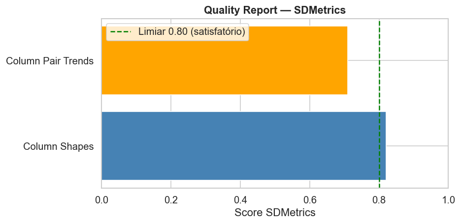
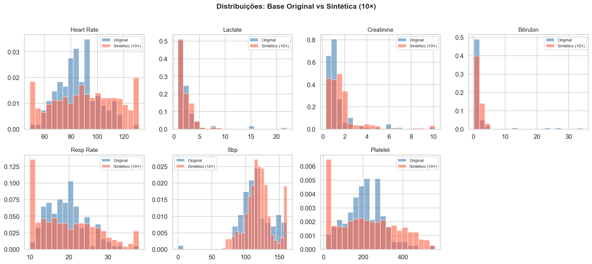
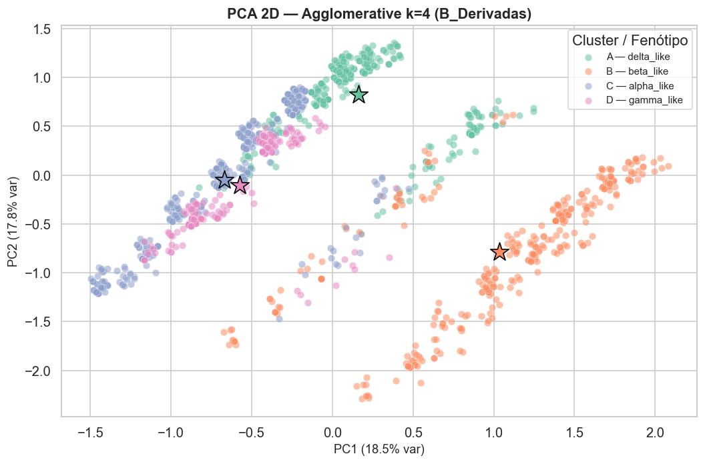
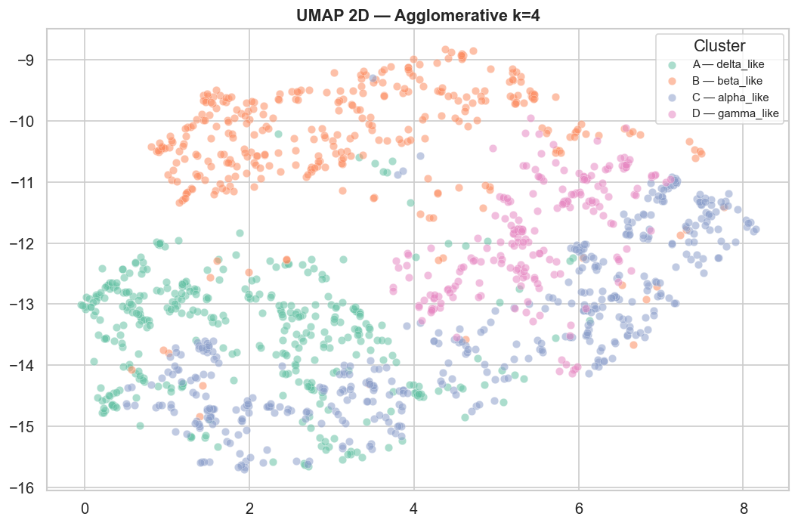
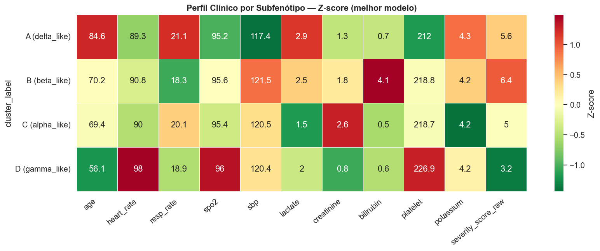
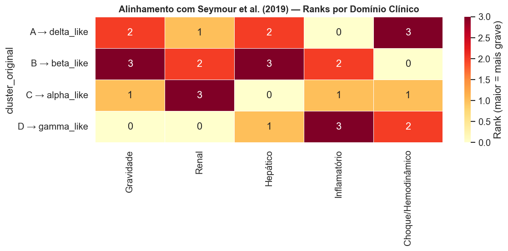

# Inteligência artificial generativa na medicina diagnóstica para identificação de subfenótipos de sepse

**Trabalho de Conclusão de Curso — MBA Data Science e Analytics | USP/ESALQ**

| | |
|---|---|
| **Aluno** | João Gabriel Pereira Ferreira |
| **Orientador** | Prof. Dr. Renato Máximo Sátiro |
| **Base de dados** | [MIMIC-III Clinical Database Demo](https://physionet.org/content/mimiciii-demo/1.4/) (PhysioNet) |
| **Notebook principal** | [`TCC_Sepse_MIMIC_CTGAN_GMM.ipynb`](TCC_Sepse_MIMIC_CTGAN_GMM.ipynb) |

---

## 1. Objetivo

Avaliar se a expansão sintética controlada de uma base clínica reduzida, por meio de **inteligência artificial generativa** (CTGAN), preserva propriedades estatísticas, relações multivariadas e estruturas fenotípicas, de modo a permitir a identificação de agrupamentos clínicos por **aprendizado não supervisionado** e sua comparação com os quatro subfenótipos de sepse (α, β, γ, δ) descritos por **Seymour et al. (2019, JAMA)**.

A base de partida é o MIMIC-III Demo: **136 estadias em UTI, referentes a 100 pacientes e 129 internações hospitalares**. A unidade de análise é a estadia em UTI.

> **Sobre a coorte.** Não foi aplicado filtro diagnóstico para seleção de casos de sepse: a coorte corresponde ao conjunto completo de estadias do demo. A definição Sepsis-3 e os domínios de disfunção orgânica de Seymour et al. (2019) orientaram a escolha das variáveis e dos limiares clínicos, funcionando como **referencial interpretativo, e não como critério de inclusão**. Os agrupamentos descrevem perfis de gravidade e disfunção orgânica em população geral de terapia intensiva.

## 2. Estrutura do pipeline

| Seção | Descrição | Principais bibliotecas |
|---|---|---|
| 0 | Configuração e imports | `pandas`, `numpy`, `scikit-learn` |
| 1 | Extração e estruturação a partir de `PATIENTS`, `ADMISSIONS`, `ICUSTAYS`, `CHARTEVENTS`, `LABEVENTS` e `PRESCRIPTIONS` | `pandas` |
| 2 | Definição das variáveis e exclusão das que têm mais de 50% de valores ausentes | `pandas` |
| 3 | Expansão sintética com **CTGAN** (2×, 5× e 10×; a base 10×, com 1.360 registros, é a utilizada nas análises) | `sdv` |
| 4 | Avaliação da qualidade sintética (Column Shapes, Column Pair Trends) | `sdmetrics` |
| 4.5 / 5 | Variáveis de risco derivadas de limiares clínicos (SOFA/Sepsis-3), `severity_score` e pré-processamento (imputação por mediana, winsorização de 1%, `RobustScaler`, PCA) | `scikit-learn` |
| 6 | Comparação de **KMeans, GMM, Agglomerative Ward, DBSCAN e HDBSCAN** sobre três conjuntos de *features* | `scikit-learn`, `hdbscan` |
| 7 | *Bootstrap* de estabilidade, `composite_score` e seleção do modelo final | `scikit-learn` |
| 8 | Análise estatística dos clusters (Kruskal-Wallis, qui-quadrado) | `scipy` |
| 9 | Alinhamento com Seymour et al. (2019) | `pandas` |
| 10 | Visualizações (PCA, UMAP, heatmaps) | `matplotlib`, `seaborn`, `umap-learn` |
| 11 | Relatório final | — |

## 3. Principais resultados

### 3.1 Expansão sintética (CTGAN)

O *Quality Report* do `sdmetrics` atingiu **76,5%** de qualidade geral — **82,1%** em Column Shapes (distribuições univariadas) e **71,0%** em Column Pair Trends (correlações bivariadas). As variáveis binárias foram as mais fiéis (óbito hospitalar 99,8%, vasopressor 98,5%, gênero 97,2%); as de menor fidelidade foram SpO₂ (62,5%), creatinina (68,9%) e lactato (71,2%).




### 3.2 Clusterização

Foram executadas **69 configurações** (3 conjuntos de *features* × algoritmos × k de 2 a 8), das quais 67 produziram métricas válidas. Os resultados completos estão em [`results_clustering_comparison.csv`](outputs_cluster_clinico/results_clustering_comparison.csv).

- O **maior Silhouette** foi obtido pelo KMeans com k = 3 sobre as variáveis originais (0,768; *bootstrap* 0,768 ± 0,008, IC 95% [0,749; 0,781]).
- A **seleção do modelo final** fixou k = 4, pela correspondência com os quatro fenótipos de Seymour et al. (2019), e exigiu que o menor cluster reunisse ao menos 12% das amostras. Nenhuma configuração com k = 4 sobre os conjuntos de variáveis originais ou híbrido atendeu a essa restrição. Duas configurações do conjunto de variáveis derivadas atenderam — KMeans (menor cluster 21,2%) e Agglomerative Ward (15,4%) —, e o **Agglomerative Ward** foi selecionado pela ordem de preferência predefinida no pipeline.
- O `composite_score` foi usado para ordenar e comparar as configurações, **não para selecionar** o modelo final.

**Modelo final: Agglomerative Ward, k = 4, conjunto de variáveis derivadas.** Silhouette 0,146 — baixo em termos absolutos, como é esperado para variáveis categóricas discretas no espaço PCA —, com clusters de 27,7%, 24,9%, 31,9% e 15,4%.




### 3.3 Perfis dos clusters

Nove das onze variáveis contínuas diferiram significativamente entre os clusters (Kruskal-Wallis, p < 0,05); plaquetas e potássio não. Entre as binárias, taquicardia, hipoxemia e taquipneia foram significativas; vasopressor, ventilação mecânica e mortalidade não. Detalhes em [`cluster_statistical_tests.csv`](outputs_cluster_clinico/cluster_statistical_tests.csv) e [`cluster_profile_summary.csv`](outputs_cluster_clinico/cluster_profile_summary.csv).

| Cluster | n (%) | Rótulo Seymour-like | Principais achados |
|---|---|---|---|
| A | 377 (27,7%) | delta_like | Idade mais elevada (84,6 anos), maior lactato (2,91 mmol/L), menor PAS (117,4 mmHg) |
| B | 339 (24,9%) | beta_like | Maior escore de gravidade (6,35) e maior bilirrubina (4,10 mg/dL), com creatinina elevada (1,77 mg/dL) |
| C | 434 (31,9%) | alpha_like | Menores lactato (1,52) e bilirrubina (0,46), porém maior creatinina (2,60 mg/dL) |
| D | 210 (15,4%) | gamma_like | Mais jovens (56,1 anos), maior frequência cardíaca (97,9 bpm), menor escore de gravidade (3,16) |

Os rótulos são **aproximações interpretativas** atribuídas por ranks de domínio clínico, e não reprodução do método de Seymour et al. (2019), que empregou análise de classes latentes. A confiança do alinhamento varia de 0,367 (gamma_like) a 0,833 (delta_like).




## 4. Limitações

- **Coorte sem filtro diagnóstico.** A base inclui todas as estadias em UTI do demo, com indicações de internação heterogêneas. O critério de Angus, baseado em códigos CID-9, identificaria cerca de metade das estadias e é um passo natural para trabalhos futuros.
- **Seleção de códigos na extração.** A extração usou `ItemIDs` específicos para cada variável. Com essa seleção, temperatura, leucócitos e sódio apresentaram mais de 50% de valores ausentes e foram excluídos, embora estejam disponíveis no banco sob códigos alternativos. A ventilação mecânica foi identificada apenas pelo código da plataforma CareVue, o que subestima sua prevalência nas estadias registradas no MetaVision.
- **Biomarcadores.** Proteína C-reativa, procalcitonina e interleucina-6 não estão disponíveis no demo. INR, troponina e ureia estão disponíveis, mas não foram incluídos na extração. Essas lacunas afetam sobretudo os fenótipos γ (hiperinflamatório) e δ (coagulopatia).
- **Dados sintéticos e validação.** Toda a clusterização foi feita sobre dados sintéticos, sem validação externa em coortes independentes.

## 5. Estrutura do repositório

```
├── TCC_Sepse_MIMIC_CTGAN_GMM.ipynb        # Notebook principal, com as saídas da execução reportada
├── PATIENTS.csv, ADMISSIONS.csv, ...      # Tabelas do MIMIC-III Clinical Database Demo
├── D_ICD_DIAGNOSES.csv, D_ITEMS.csv, ...  # Tabelas de dicionário
├── LICENSE.txt                            # Licença ODbL dos dados MIMIC-III Demo
├── Derivation-Validation...pdf            # Artigo de referência (Seymour et al., 2019)
├── outputs_cluster_clinico/               # Resultados tabulares e figuras das Seções 5 a 11
│   ├── results_clustering_comparison.csv
│   ├── cluster_profile_summary.csv
│   ├── cluster_statistical_tests.csv
│   ├── cluster_seymour_phenotype_alignment.csv
│   ├── cluster_clinical_interpretation.csv
│   └── fig_*.png
└── fig_*.png                              # Figuras da avaliação da qualidade sintética
```

## 6. Fonte de dados e considerações éticas

Este projeto utiliza o **MIMIC-III Clinical Database Demo (v1.4)**, subconjunto público de 100 pacientes do MIMIC-III, distribuído sob a licença **[Open Data Commons Open Database License (ODbL)](LICENSE.txt)**. Diferentemente da base completa, a versão demo não exige credenciamento no PhysioNet e permite redistribuição.

Citação exigida pela fonte dos dados:

> Johnson, A., Pollard, T., & Mark, R. (2016). MIMIC-III Clinical Database Demo (version 1.4). PhysioNet. https://physionet.org/content/mimiciii-demo/1.4/

## 7. Como executar

```bash
pip install pandas numpy scikit-learn scipy matplotlib seaborn \
            sdv sdmetrics umap-learn hdbscan

jupyter notebook TCC_Sepse_MIMIC_CTGAN_GMM.ipynb
```

Desenvolvido em **Python 3.13**, com os CSVs do MIMIC-III Demo na mesma pasta do notebook (`MIMIC_DIR = '.'`).

> **Sobre a reprodutibilidade.** A extração e a estruturação dos dados são determinísticas e reproduzíveis. O treinamento do CTGAN, porém, depende de inicialização estocástica não controlada pela semente fixada (42, aplicada a NumPy e scikit-learn), de modo que **cada execução gera uma base sintética diferente** e, portanto, números distintos dos reportados. Os resultados deste repositório e do TCC correspondem à execução registrada nas saídas preservadas do notebook.
>
> Se os CSVs do MIMIC não forem encontrados, o notebook gera dados simulados apenas para demonstração do fluxo; os resultados reportados foram obtidos com a base real.

## 8. Referências

- JOHNSON, A.E.W. et al. *MIMIC-III, a freely accessible critical care database*. Scientific Data, 2016.
- ROUSSEEUW, P.J. *Silhouettes: a graphical aid to the interpretation and validation of cluster analysis*. Journal of Computational and Applied Mathematics, 1987.
- SEYMOUR, C.W. et al. *Derivation, validation, and potential treatment implications of novel clinical phenotypes for sepsis*. JAMA, 2019.
- SINGER, M. et al. *The third international consensus definitions for sepsis and septic shock (Sepsis-3)*. JAMA, 2016.
- XU, L. et al. *Modeling tabular data using conditional GAN*. NeurIPS, 2019.
- SCIKIT-LEARN. *Documentation*. https://scikit-learn.org/
- SDV. *Synthetic Data Vault documentation*. https://docs.sdv.dev/sdv/
- SDMETRICS. *SDMetrics documentation*. https://docs.sdv.dev/sdmetrics/
